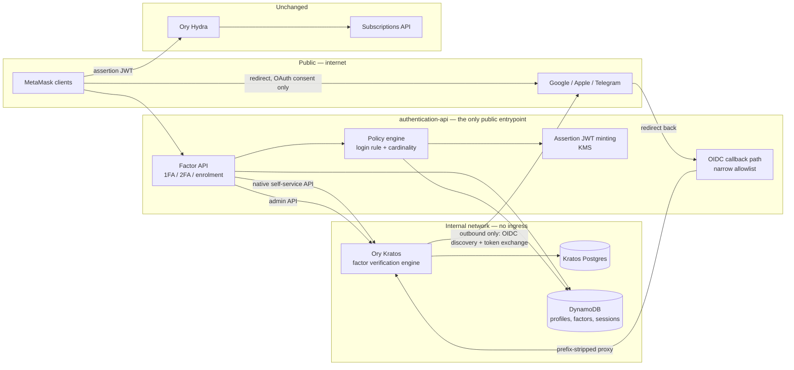
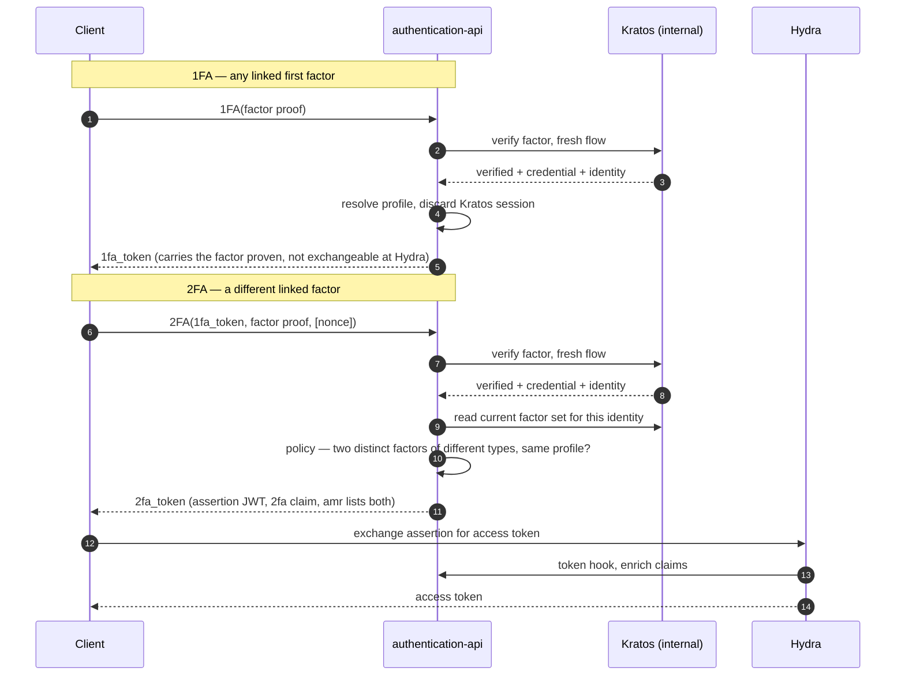
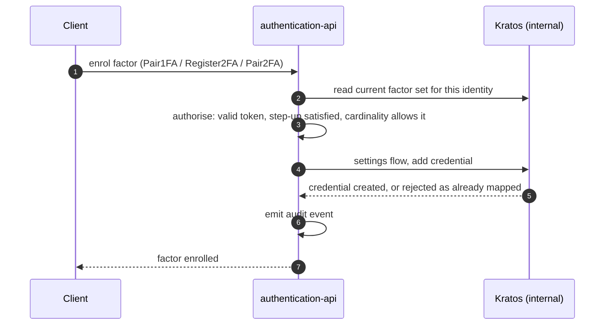
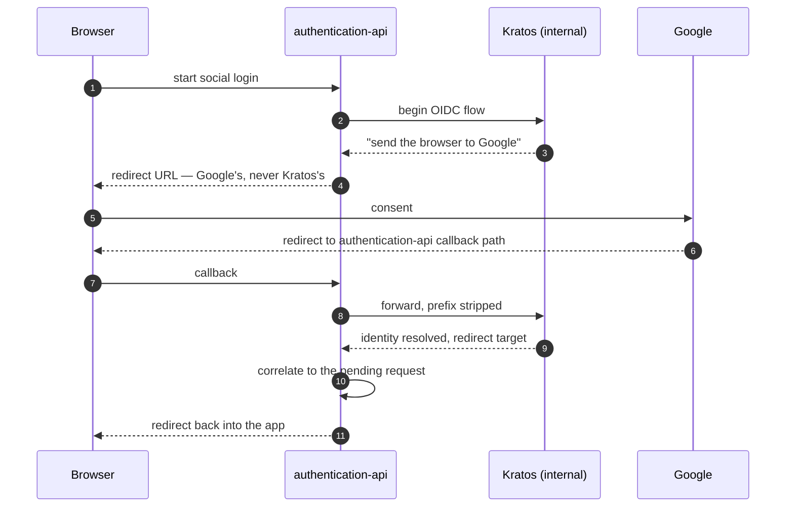
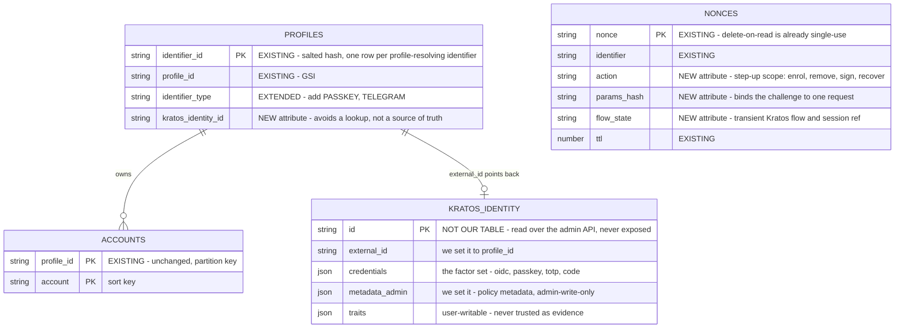

# Integrating authentication-api with Ory Kratos

Status: **Draft — for review**

Deciders: MFA Money Account Team

Date: 2026-08-19

Related:

- [Money/0007 — MFA Auth Factors Management](https://github.com/MetaMask/decisions/blob/02685b197dc22ac7bd02eb62df308c64773c4e6f/decisions/money/0007-mfa-auth-factors-management.md) — decides _where factors live_. This ADR assumes its leaning, Option 4.
- [Auth Layer Requirements](https://github.com/MetaMask/decisions/blob/02685b197dc22ac7bd02eb62df308c64773c4e6f/decisions/money/background/auth-layer-requirements.md) — the factor matrix and the login rule.
- [authentication-api](https://github.com/consensys-vertical-apps/va-mmcx-authentication-api) — the service this ADR proposes changes to.
- [Ory: Multi-factor authentication overview](https://www.ory.com/docs/kratos/mfa/overview) — Kratos factor classification and AAL rules.

---

## How to use this document

This is a **first-pass architecture proposal**. It is deliberately high level: it fixes the shape of the integration and the boundaries between services, and stops there. Request bodies, headers, response schemas, error codes and Kratos flow-node details are **out of scope on purpose** — those belong in a technical design that follows once we agree on the shape.

The goal is agreement on five things:

1. Where the boundary between authentication-api and Kratos sits.
2. Who decides that a login succeeded.
3. What the user can and cannot see.
4. What has to change in authentication-api.
5. What we have not solved yet.

---

## Context

Money needs MFA. ADR 0007 evaluated four ways to split the work between authentication-api and Ory Kratos and leans towards **Option 4: Kratos verifies factors, authentication-api owns the profile-to-factor mapping, the login policy, and token minting.**

The reason Option 4 exists at all is one requirement that Kratos cannot express:

> A login is any **two distinct linked factors** of different types, at least one of which can resolve the profile.

Kratos models assurance as a ladder — `aal1` then `aal2` — and its documentation is explicit that _completing two first factors does not produce `aal2`_. So a profile holding Google, Passkey and Time OTP must accept `Google → Passkey`, but Kratos will report that session as `aal1` forever. The rule is not a ladder, so a service that only speaks ladders cannot be the one that decides.

Option 4 answers _who owns the policy_. This ADR answers the next question: **given that split, how do the two services actually talk to each other, and what changes in authentication-api?**

### The additional constraint this ADR adds

Kratos runs **inside the internal network only**. Users must not know Kratos exists, must never receive a Kratos URL, cookie, session token, identity ID or flow ID, and must have no path to reach Kratos other than through authentication-api. This is not just a firewall rule — it constrains the integration design, because several Kratos flows want to redirect a browser to a Kratos-served URL.

### What this ADR decides

- The integration pattern between authentication-api and Kratos.
- Which service is authoritative for which piece of state.
- The changes required in authentication-api: new components, data model, API surface.
- How Kratos is kept invisible, including the flows where that is hard.

### What this ADR does **not** decide

- Whether Option 4 is the right choice — that is ADR 0007's job.
- Wire-level API contracts, error taxonomy, or Kratos configuration values.
- Rollout, migration of existing profiles, and cutover sequencing.
- Which factors ship in V0.

---

## Decision summary

Five decisions, each expanded below.

| #      | Decision                                                                            | In one line                                                                                                                                                                      |
| ------ | ----------------------------------------------------------------------------------- | -------------------------------------------------------------------------------------------------------------------------------------------------------------------------------- |
| **D1** | **authentication-api is a facade, not a proxy**                                     | Every user-facing call terminates in authentication-api, which drives Kratos server-to-server over its native API. No Kratos identifier of any kind crosses the public boundary. |
| **D2** | **Kratos sessions are internal, transient receipts**                                | The Kratos session token is held server-side and discarded. The session the user holds is authentication-api's, and it is the only one.                                          |
| **D3** | **Each factor verification is an independent event, carried in the token we issue** | We do not try to accumulate factors inside a single Kratos session, and we do not read Kratos's AAL as the verdict.                                                              |
| **D4** | **The login rule is evaluated by authentication-api**                               | "Two distinct linked factors of different types" is policy code in a service we control. Kratos's `aal1`/`aal2` is corroborating signal, never the decision.                     |
| **D5** | **Kratos is the single source of truth for which factors a profile has**            | authentication-api derives the factor set from Kratos on demand rather than mirroring it. No new table, and no second store to keep consistent.                                  |

---

## Architecture

### Topology

Three properties of this picture are load-bearing:

**Kratos has no ingress.** No load balancer, no published port, no DNS record. Only authentication-api's security group can reach its public port (4433) and admin port (4434). This matters more than it looks: Kratos's admin API — which can read and delete any identity — **ships with no authentication of its own**. Network isolation is the only control protecting it, so it has to be treated as a hard deployment requirement rather than defence in depth.

**Kratos still needs outbound internet.** It performs OIDC discovery and the authorization-code exchange against Google and Apple directly. "Internal" here means _no inbound path_, not _no network_.

**Kratos is configured to believe it lives at an authentication-api URL.** Its public base URL is set to a path under authentication-api's hostname, so every absolute URL it generates — most importantly the OAuth `redirect_uri` it registers with Google — already points at us. Kratos never emits a URL the user could follow to Kratos itself.

### Who owns what

| Concern                            | Owner              | Notes                                                                                 |
| ---------------------------------- | ------------------ | ------------------------------------------------------------------------------------- |
| Profile ID and profile lifecycle   | authentication-api | Unchanged from today. Kratos identity IDs are never exposed.                          |
| Profile ↔ factor mapping           | **Kratos**         | Held in the identity's credentials; read on demand rather than mirrored.              |
| Cardinality and enrolment rules    | authentication-api | One OIDC provider, one E-Mail OTP, many passkeys — none of these are Kratos concepts. |
| The login rule                     | authentication-api | The two-distinct-factors rule.                                                        |
| Credential material and ceremonies | **Kratos**         | WebAuthn ceremonies, TOTP seeds, OTP generation and throttling, OIDC handshakes.      |
| Assurance level                    | authentication-api | Derived from the factors proven in this login. Kratos's AAL is read as corroboration. |
| Session the user holds             | authentication-api | `1fa_token` then `2fa_token`, then Hydra access token as today.                       |
| Access tokens and scopes           | Ory Hydra          | Unchanged.                                                                            |

### Factor placement

Kratos fixes the assurance level a strategy can be used at. Our factors map onto its strategies as follows:

| Our factor                     | Verified by        | Kratos strategy                   | Role in our policy                              |
| ------------------------------ | ------------------ | --------------------------------- | ----------------------------------------------- |
| OIDC — Google, Apple, Telegram | Kratos             | `oidc`                            | Resolves the profile; can open or close a login |
| Passkey                        | Kratos             | `passkey` (first-factor strategy) | Resolves the profile; can open or close         |
| E-Mail OTP                     | Kratos             | `code`                            | Resolves the profile; can open or close         |
| Time OTP                       | Kratos             | `totp`                            | Closes only                                     |
| SRP                            | authentication-api | none                              | Existing flow, stays where it is                |
| Signing Key Pair               | authentication-api | none                              | No Kratos equivalent                            |

Passkeys must be enrolled under Kratos's **first-factor** `passkey` strategy, not the second-factor `webauthn` strategy, so that a passkey can lead a login as the requirements demand.

---

## The core mechanic: factor verification as an event

This is the part worth reading twice, because it is what makes the rest simple.

The naive reading of Option 4 is: authentication-api asks Kratos to build up a session, factor by factor, and then inspects it. That reading is what generated ADR 0007's two sharpest objections — _"verifying an `aal1` credential outside a login is not a flow Kratos offers"_ and _"it bypasses Kratos's own session and AAL state, which then has to be kept consistent"_.

That reading does not survive contact with Kratos. Kratos will append a second factor to an existing session for its native-API strategies, but for OIDC it creates a **new, separate session** rather than extending the one you hold. The only way to make a single Kratos session report both factors is to modify its session records directly — which is not a technique that can ship. The right conclusion is not to work harder at it: it is to stop fighting Kratos's session model.

So we invert it. **We never ask Kratos to accumulate anything.** Each verification is a standalone question:

> Did the holder of this request prove factor _X_ belonging to Kratos identity _I_, just now?

authentication-api starts a fresh Kratos flow, gets a yes or no plus which credential was used and when, carries that fact forward in the token it issues, and throws the resulting Kratos session away. Kratos becomes stateless from our point of view — a verification oracle with a credential store attached.

Three consequences follow immediately, and they are the reason to prefer this framing:

- The extra session Kratos creates on OIDC verification stops being a problem. A throwaway session is exactly what we wanted anyway.
- There is only ever **one** session state to keep consistent, because Kratos's is discarded. ADR 0007's consistency objection does not apply to this shape.
- Two `aal1` factors is not a special case. Google-then-Passkey is two verification events, same as Passkey-then-TOTP. The policy engine never looks at AAL.

The one place Kratos sessions genuinely persist is **enrolment**: adding a passkey, enrolling TOTP or linking a provider all run through Kratos's settings flows, which require a live and recently-authenticated Kratos session. authentication-api holds that session server-side for the duration of the operation and discards it afterwards. Kratos's own "privileged session" freshness window becomes an implementation detail of our step-up requirement, not something the user ever sees.

The scope of that is worth stating precisely, because it is narrower than "we now manage Kratos sessions". Login retains nothing — each verification is a fresh flow whose session is read and dropped. Only the enrolment ceremonies hold one, only across the two legs of a single ceremony, and only on the flow-state row that ceremony already needs for its Kratos flow ID. That row expires on its own within minutes. Kratos offers no administrative way to mint a session for an identity, so this cannot be avoided by re-authenticating per request — but there is no session lifecycle to track, refresh or revoke either.

---

## Flows

### Login

The important detail is what the two tokens are for. **`1fa_token` is an intermediate credential, not a session** — it is not accepted by Hydra and unlocks nothing on its own. **`2fa_token` is the assertion JWT** the service already mints today, now carrying a `2fa` claim and an `amr` claim listing both factors. Everything downstream of that arrow — Hydra, the token hook, subscription claims — is unchanged.

The policy check between the last two steps is the whole reason for Option 4. It asks: are both factors linked to the same profile, are they of different types, and are they different instances? It does not ask Kratos for an assurance level.

One thing is deliberately absent from both tokens: **the Kratos session token itself.** Carrying it as a claim is tempting, because it would correlate the app token to a live Kratos session with no server-side state. The problem is that a JWT claim is encoded, not encrypted, and this JWT is client-visible by design — it is handed to the client and exchanged at Hydra. A claim containing `ory_st_…` therefore gives every holder of the token a working Kratos credential, and leaves copies of it in logs, client storage and any proxy along the way. It would also undo the constraint the whole design rests on, since the user would now possess the means to talk to Kratos directly. Where a later operation genuinely needs the Kratos session, the token carries an **opaque handle** to server-side flow state instead, and never the credential.

### Enrolment

Note what is absent: there is no reservation step and no local row to write. authentication-api does still run a pre-check before starting the flow — `credentials_identifier` resolves whether the factor is already mapped elsewhere, which is what lets us fail cleanly _before_ sending a browser off to Google rather than after. But that pre-check exists for the error message, not for correctness. Kratos enforces that a factor identifier belongs to at most one identity, so a concurrent link that slips between our check and our write is rejected by Kratos. We surface that rejection rather than building a protocol to prevent it.

What Kratos has no opinion on is our own cardinality — exactly one OIDC provider fixed at account creation, at most one E-Mail OTP, several passkeys but never two passkeys as a login pair. Those are evaluated against the factor set read one step earlier, with a conditional write on the profile row to settle concurrent enrolments of _different_ factors on the same profile.

### The one flow where Kratos is visible: OIDC

Social login is the only case where the user's browser has to leave authentication-api, because the OAuth consent screen is at Google.

Two things make this safe. First, Kratos's configured base URL means the `redirect_uri` registered with Google is **an authentication-api URL** — the browser is never handed a Kratos hostname, and Google is never told one. Second, the callback path is a **narrow allowlist**: exactly the OIDC callback routes, method-restricted, nothing else.

That second point deserves emphasis, because the tempting shortcut is a wildcard prefix that forwards anything under `/kratos/*`. A wildcard silently republishes the entire Kratos self-service API — including settings, where credentials are added and removed — to the internet, with authentication-api's own session context attached. It is a one-line mistake with total impact, and it is the single most important thing to get right in this design.

Telegram needs an additional adapter, and for a specific and time-bound reason. Telegram publishes an ES256K key in its JWKS, and Kratos fails to parse the **entire** key set when it encounters one — even though the ID token itself is RS256. That is an upstream bug ([ory/kratos#4572](https://github.com/ory/kratos/issues/4572), open), not a design constraint on our side. Until it is fixed, Kratos cannot consume Telegram directly, and a broker that completes the real Telegram exchange and re-issues a conforming token is required. Since authentication-api already implements Telegram login today, the cheaper path is to leave it there for now — the bug may well close before we would need the adapter.

---

## Changes required in authentication-api

### New components

| Component                       | Responsibility                                                                                                             |
| ------------------------------- | -------------------------------------------------------------------------------------------------------------------------- |
| **Kratos client**               | Drives native self-service and admin APIs. Interprets flow outcomes. Never leaks Kratos identifiers upward.                |
| **Factor resolver**             | Reads the current factor set from Kratos and presents it as our factor vocabulary. Owns cardinality and enrolment rules.   |
| **Policy engine**               | Evaluates the login rule and any per-operation floors. The only place that decides a login succeeded.                      |
| **Flow state store**            | Short-lived server-side state for multi-step ceremonies, including the transient Kratos session token. Extends `Nonces`.   |
| **Challenge / step-up service** | Issues single-use, action-scoped challenges for sensitive operations. Carries the optional `nonce` from `2FA(…, [nonce])`. |
| **OIDC callback handler**       | The narrow allowlisted path, plus correlation of the returning browser to the pending request.                             |

An existing client library for Kratos's OTP flows is already present in the service but is not wired to any route. It is a starting point, not a design.

### Data model

**No new tables.** The factor set lives in Kratos and is read on demand rather than mirrored. Two existing tables gain a few attributes.

That is possible because Kratos's admin API answers almost everything a policy engine needs to ask:

| Question                                          | Answered by                                                                                                                                                                   |
| ------------------------------------------------- | ----------------------------------------------------------------------------------------------------------------------------------------------------------------------------- |
| Which factors does this profile have?             | The identity's `credentials` map: `oidc`, `passkey`, `totp`, `code`                                                                                                           |
| Which OIDC provider, and which subject?           | `credentials.oidc.config.providers[]` — `provider` and `subject`                                                                                                              |
| How many passkeys, and which ones?                | `credentials.passkey.config.credentials[]` — each with its own `id`, `added_at`, `display_name`                                                                               |
| Is Time OTP enrolled?                             | `credentials.totp.config.totp_url` is non-empty                                                                                                                               |
| Which address backs E-Mail OTP?                   | `credentials.code.config.addresses[]`                                                                                                                                         |
| When was a factor enrolled?                       | `created_at` per credential type, `added_at` per passkey                                                                                                                      |
| Is this factor already mapped to another profile? | `credentials.identifiers[]` are **globally unique**. Kratos rejects the duplicate link itself, and `GET /admin/identities?credentials_identifier=…` answers it as a pre-check |
| Which profile owns this identity?                 | `identity.external_id`, which we set to our `profile_id`, with a direct lookup at `GET /admin/identities/by/external/{id}`                                                    |
| Is a factor a first or second factor?             | Not data at all — a fixed property of the Kratos strategy, so it is a constant in our code                                                                                    |

Two of those fields carry more weight than the rest. **`external_id`** makes the Kratos identity carry our profile ID, with its own lookup route, so the identity ↔ profile mapping is resolvable in both directions without storing it — this is what removes the need for the dedicated mapping table the design would otherwise want. And **`metadata_admin`** is writable only through the admin API — it appears in no self-service flow — so any policy metadata that genuinely must persist can live on the identity without being user-writable.

What remains on our side is a login attempt's own state. The 1FA→2FA correlation travels in the signed `1fa_token`, so it needs no storage. Two things do: a single-use challenge for sensitive actions, and a Kratos session token held across the two legs of a multi-step ceremony. Both are keyed, short-lived and consumed once — the shape of the `Nonces` table the service already has, where delete-on-read is already single-use.

The Kratos box is not a table we own or query — it is the identity document as the admin API returns it, drawn here to show where the factor set actually lives. Four rules govern how this is read and written:

**Derive, do not mirror.** The factor set is read from Kratos at the point of decision. Anything cached is an optimisation with a short TTL, invalidated on enrolment and removal, and never consulted for an authorization decision it could get wrong.

**Identifiers come from credentials, never from identity attributes.** The link between a profile and a Google account must come from `credentials.oidc.config.providers[].subject`, not from an email or ID field on the identity. Those fields are user-writable through the settings flow, so a design that reads them lets one user claim another user's identifier and repoint the mapping at themselves. This is a rule, not a preference.

**Let Kratos lose the race.** Concurrent attempts to link one factor to two profiles do not need a reservation protocol, because Kratos enforces credential-identifier uniqueness itself and will reject the loser. Our own cardinality rules — one OIDC provider per profile, one E-Mail OTP — are not Kratos rules, and are enforced with a conditional write on the existing `PROFILES` row.

**A profile exists only once a social factor does.** Account creation always runs through OIDC, so the profile row and the `external_id` link are written at social registration and never before. A user who starts a passkey enrolment and abandons it leaves a Kratos identity with no profile and no `external_id` — inert, invisible to every profile lookup, and safe to reap on a schedule. The corollary matters more than the rule: nothing in the system may assume that every Kratos identity has a profile.

Two costs come with this, and neither is bought off by adding a table. Every policy decision needs a read from Kratos — acceptable because it accompanies a verification call we are making anyway, but it does make Kratos load scale with authorization traffic. And because Kratos's admin API has no authentication of its own, a credential written straight into it would be indistinguishable from one we enrolled. A mirror table would not catch that, since the same code path that was tricked into enrolling would write the mirror too. The control that does catch it is an **append-only audit event** on every enrolment and removal, reconciled against Kratos on a schedule — detection in the event stream, which the service already publishes, rather than state on the hot path.

### API surface

The requirements document defines six operations. They map onto new authentication-api routes; the shape is what matters here, not the paths.

| Requirement               | Public operation                    | What authentication-api does                                 |
| ------------------------- | ----------------------------------- | ------------------------------------------------------------ |
| `Register1FA`             | Create account with a social factor | Creates the Kratos identity and the profile in one operation |
| `Pair1FA`                 | Add passkey or E-Mail OTP           | Check cardinality → Kratos settings flow → audit event       |
| `Register2FA` / `Pair2FA` | Add Time OTP, SMS OTP, Signing Key  | Same, with a step-up requirement                             |
| `1FA`                     | Authenticate with a first factor    | Verify via Kratos → `1fa_token` carrying the factor proven   |
| `2FA`                     | Close the login                     | Verify via Kratos → policy over the factor set → `2fa_token` |
| —                         | List and remove factors             | Read from Kratos; removal goes through Kratos                |

Every one of these is initiate-then-verify in practice, because WebAuthn, OTP and OIDC are all two-step. That is an implementation detail, not an architectural one.

### What does not change

Worth stating plainly, because it bounds the blast radius:

- The profile ID, profile pairing, aliases, accounts and MetaMetrics lineage.
- The assertion JWT → Hydra exchange, the token hook, and subscription claims.
- SRP login. SRP has no Kratos equivalent and stays exactly where it is.
- Every internal service-to-service lookup route.
- The BIP-322 sidecar and account ownership proofs.

---

## Consequences

**Good**

- The login rule becomes ordinary application code, reviewable and testable, in a service we own. New combinations, per-operation floors and timelocks are policy changes, not vendor limitations.
- The security-sensitive ceremonies — WebAuthn, TOTP seed handling, OTP throttling — stay Kratos's to implement and maintain.
- One profile ID, one session, one place that mints tokens. No reconciliation between two identity namespaces.
- No new tables. The factor set has one authoritative home, so there is no mirror to drift, no dual-write to make transactional, and no repair job to own.
- The public API contract is ours. Kratos can be upgraded, reconfigured or eventually replaced without a client-visible change.
- Kratos's blast radius is bounded by the network, and the parts of Kratos that are risky to expose are never exposed.

**Bad, or at least costly**

- Kratos plus its Postgres becomes a new dependency on the login critical path. Its availability is now our availability, and because we deliberately do not mirror the factor set, a Kratos outage also means we cannot show a user their own factors.
- Every policy decision needs a read from Kratos. Cheap relative to the verification call it accompanies, but it makes Kratos load scale with authorization traffic, not just with logins.
- Kratos's public base URL is pinned to authentication-api's hostname. Changing it invalidates in-flight flows and the redirect URIs registered with each IdP.
- Passkeys bind to a hostname at enrolment. That hostname is now an irreversible decision.
- An extra network hop on every authentication.
- We take on operating Kratos: migrations, upgrades, secret rotation, and the fact that its admin API's only protection is the network.

## Risks

| Risk                                   | Why it matters                                                                                                                        | Mitigation                                                                                            |
| -------------------------------------- | ------------------------------------------------------------------------------------------------------------------------------------- | ----------------------------------------------------------------------------------------------------- |
| Kratos admin API has no authentication | Full identity read and delete for anything that can reach it                                                                          | Network isolation as a hard requirement, enforced in IaC and verified in CI, not assumed              |
| Callback path over-exposure            | A wildcard proxy silently republishes all of Kratos                                                                                   | Explicit allowlist, method-restricted; treat as a security-review gate                                |
| Availability coupling                  | Kratos down means no logins                                                                                                           | Capacity and failure-mode review before cutover; decide whether SRP remains a Kratos-independent path |
| Hostname pinning                       | Passkey `rp.id`, OIDC redirect URIs and Kratos's base URL all bind to it                                                              | Fix the production hostname before any real enrolment                                                 |
| Existing Google/Apple profiles         | They already have Kratos identities created through a registration webhook, mapped by Kratos identity ID rather than provider subject | Migration plan required; treated as out of scope here                                                 |
| Latency                                | An extra hop on the login path                                                                                                        | Measure against the current SRP path before committing                                                |
| Kratos version drift                   | Several behaviours this design depends on are version-specific                                                                        | Pin the version; hold an integration suite that exercises each dependent behaviour on upgrade         |
| Undetected factor injection            | With no local mirror, a credential written straight into Kratos looks identical to one we enrolled                                    | Append-only audit event per enrolment and removal, reconciled against Kratos on a schedule            |

## Appendix: Kratos behaviours this design depends on

Version-specific characteristics of Kratos that the architecture above is built around. They are stated here so that reviewers can challenge the design on its premises, and so that an upgrade knows what to re-verify.

**Session and assurance**

- Completing two first factors leaves the session at `aal1`. There is no supported configuration that changes this.
- A second verification using a native-API strategy can extend an existing session's method list. OIDC cannot: it produces a separate session instead.
- Settings flows that add or remove credentials require a live session that authenticated recently, within a configurable privileged window. A stale session is rejected and must re-authenticate first.
- The default assurance requirements on session introspection and settings need explicit configuration; the defaults assume Kratos owns the policy, which under this design it does not.

**OIDC**

- Login and registration through OIDC complete via a token exchange, and linking a provider to an existing identity requires a browser round trip that carries a Kratos continuity cookie. Neither has a fully headless path.
- The `redirect_uri` Kratos registers with each provider is derived from its configured public base URL. Changing that URL invalidates in-flight flows and every redirect URI registered with every IdP.
- Provider attribute mapping runs at registration only. Attributes copied from an IdP at sign-up are not refreshed on later logins, so they must not be treated as current.

**Credentials**

- The identity document exposes, per credential type, a `config` describing what is actually enrolled: OIDC provider entries carry `provider` and `subject`; passkey entries carry a per-credential `id`, `added_at` and `display_name`; TOTP carries `totp_url`; the `code` strategy carries its addresses. Each credential type also carries `created_at`. This is what makes the factor set derivable rather than something we have to mirror.
- Credential `identifiers` are unique across the whole store, so one factor can belong to at most one identity, enforced by Kratos rather than by us. `GET /admin/identities?credentials_identifier=…` resolves an identifier to its identity by exact match.
- Identities carry an `external_id` with a dedicated lookup route, which is where our profile ID lives, and `metadata_admin` / `metadata_public`, which appear in the admin create and update bodies but in no self-service flow — so they are admin-write-only.
- A credential row can exist without the corresponding factor being usable. Whether a factor is actually enrolled must be determined from the credential's configuration, not from the presence of the row.
- The last remaining first-factor credential cannot be removed; Kratos rejects the attempt.
- Passkey enrolment binds to a hostname at the moment of registration and cannot be migrated to another hostname afterwards.
- Identity attributes are writable by the user through the settings flow. They are not evidence of anything and must never back an identifier mapping.

**Operations**

- The admin API has no authentication mechanism of its own.
- Kratos requires outbound network access to each OIDC provider for discovery and token exchange.
